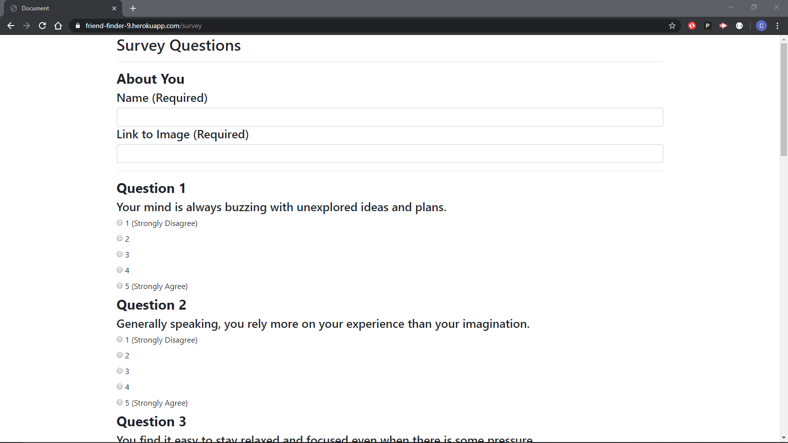
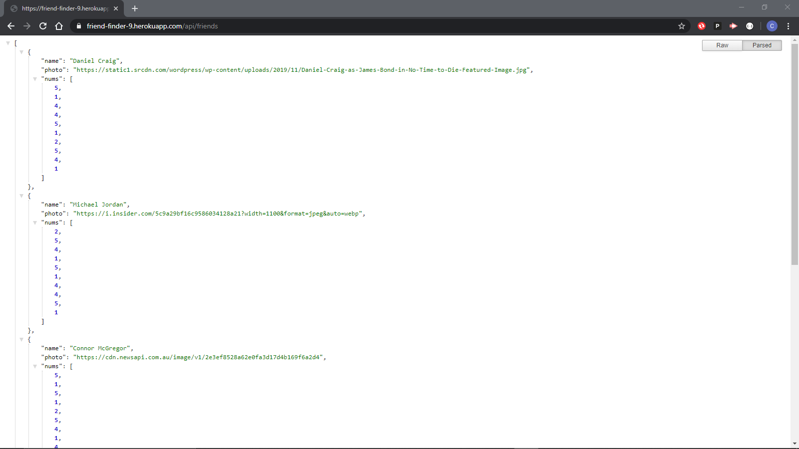
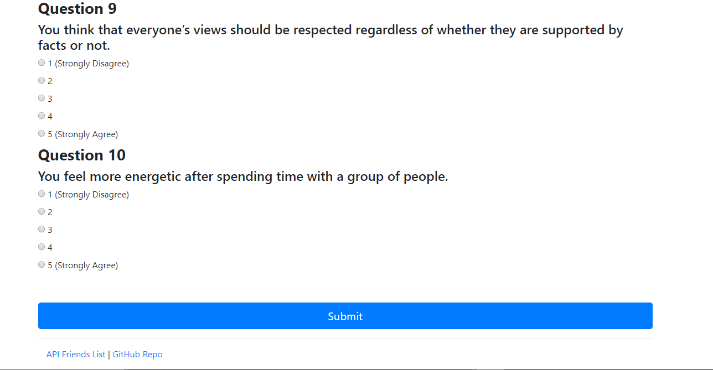

# **friendFinder**

This *Friend Finder* application allows *you* the user to answer our simple 10 question survey and match with our own list of previous customers, which comprise of some of the biggest names in HollyWood. The Simple questions allow for an easy user experience and quick Friend Selection. 

The app's process:
* Entering Inormation
    * The *Friend Finder* Application compares your answers against celebrities
* Algorithm
    * Using our "*rather complex*" matching algorithm we find you the best match out there
* Displaying New Friend
    * the algorithm finds your best match
    * but there seems to be a bug when it comes to displaying it

**Functionality**

The *Friend Finder* application starts on our landing page. 

From there the user is sent to the survey page to complete the survey and find a match.

There the user can either check out the exclusive celebrities they will have the priviledge of matching with.

Or they can see the github repository for this project.

**NPM's required**
* express
* path